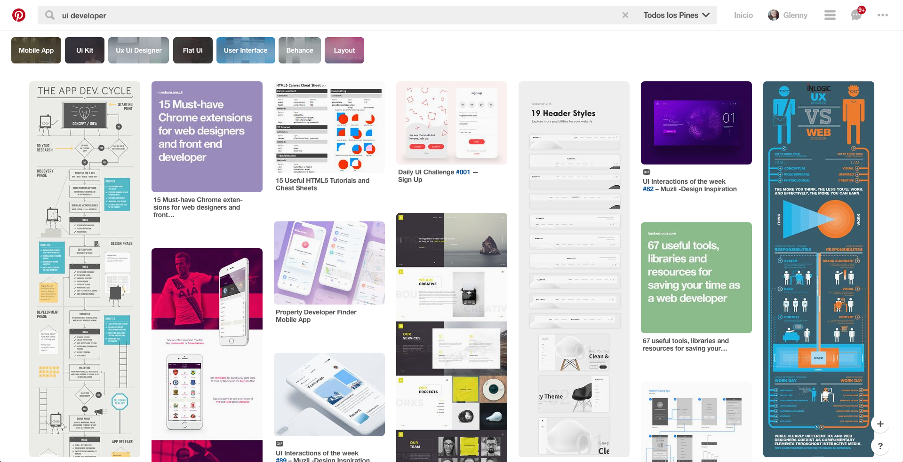
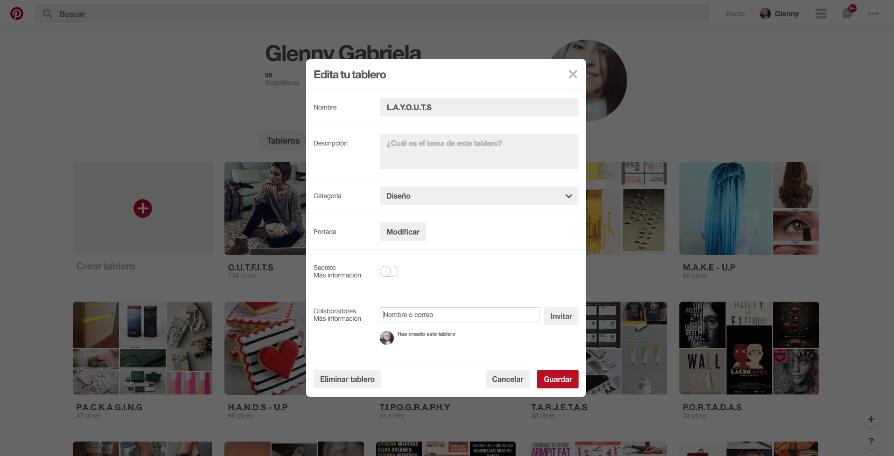
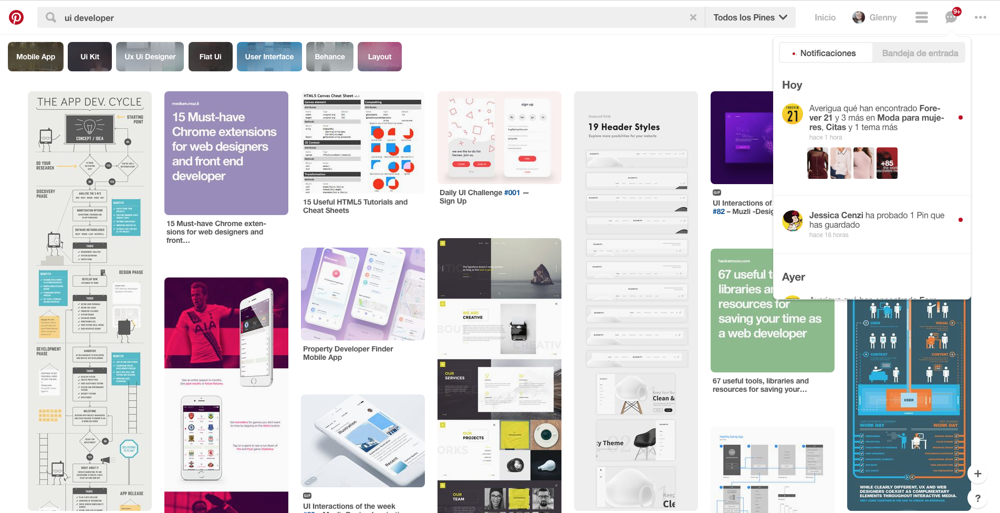
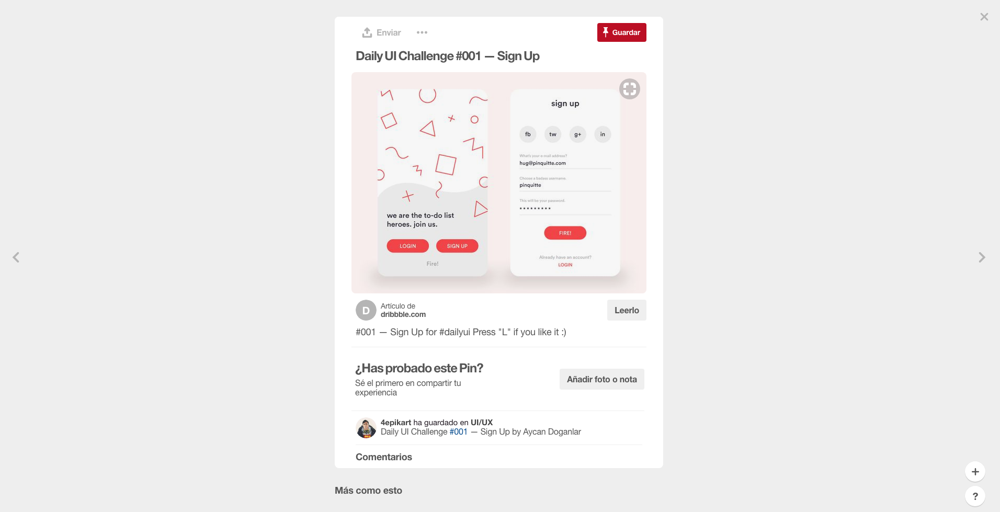
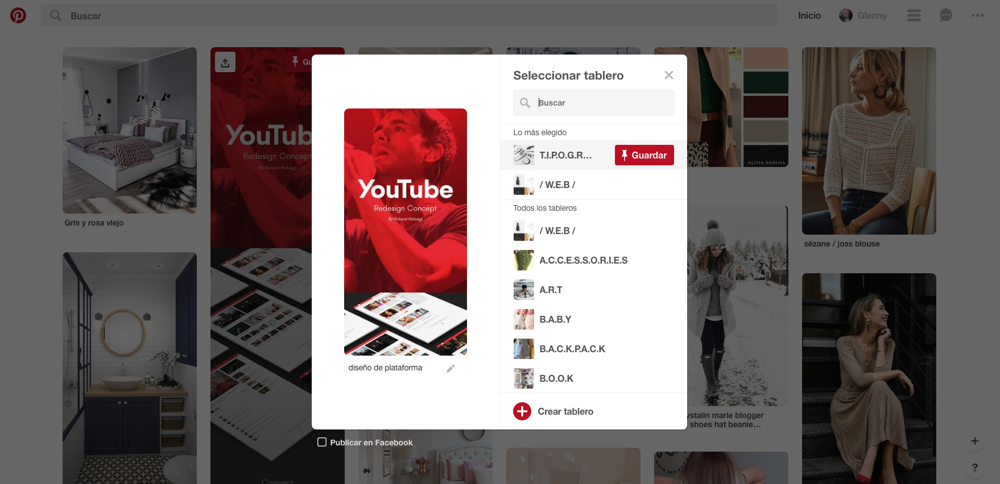

# Identificación UX - UI

* **Track:** _Common Core_
* **Curso:** _Creando tu primer sitio web interactivo_
* **Unidad 02:** _Intro a User Experience Design_

***

El presente reto pone a prueba nuestros conocimientos básicos sobre UX y UI.

## Objetivo

El reto consiste en identificar y explicar qué partes conforman el UX y qué partes el UI de las tres siguientes páginas web: **Pinterest, Youtube y  Laboratoria**.

## 1. Pinterest  
#### UX
* Puedo seguir a otros usuarios y a tableros concretos con los mismos gustos e intereses que los mios.
* Tiene la opción de navegar entre lo que las otras personas han compartido a través de los _pinboards._
* Me sugiere categorías basadas en mi historial de búsqueda.
* Puedo instalar una extensión en mi navegador para hacer _Pin it_ en todas las imágenes que me guste mientras navego en otras páginas web.
* Para obtener más información sobre alguna imagen o video, puedo hacer _click_ sobre el botón _visitar_, que me dirige a la página web de la cual puedo obtener más contenido.
* Me permite enviar cualquier contenido a través de mis redes sociales.
* Me permite tener tableros privados.
* Me manda notificaciones sobre mis últimas actividades y la de mis contactos.

#### UI
* Estructura y diseño de los tableros de los usuarios.
* Los colores de la marca ( rojo y gris claro).
* Diseño de los botones e iconos.
* Diseño de los menús
* Diseño y organización de los formularios y edición de tableros.
* Utilización adecuada de la jerarquía de la familia tipográfica.
* El diseño de las sub-categorias que responden a una búsqueda mas específica.

  

  

## Autor

* Gabriela Mamani Flores.
